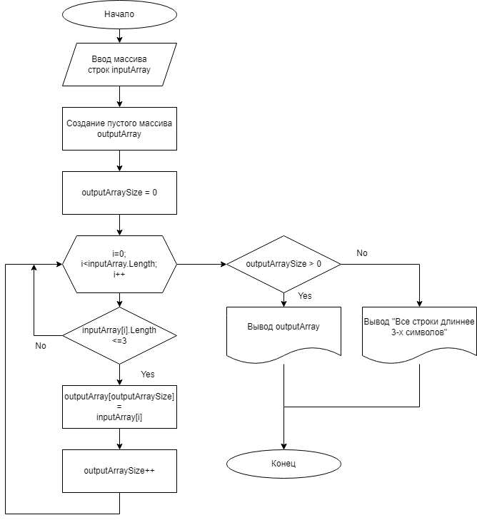

## Задача 

Написать программу, которая из имеющегося массива строк формирует новый массив из строк, длина которых меньше, либо равна 3 символам. Первоначальный массив можно ввести с клавиатуры, либо задать на старте выполнения алгоритма. При решении не рекомендуется пользоваться коллекциями, лучше обойтись исключительно массивами.

## Описание алгоритма

1. Вводим с клавиатуры массив строк inputArray.
2. Создаем новый пустой массив строк outputArray того же размера, что и inputArray. 
3. Создаем счетчик строк в массиве outputArray, называем его outputArraySize и присваиваем ему начальное значение, равное нулю.
4. Циклом просматриваем каждый элемент массива inputArray.
5. Если текущий элемент массива inputArray содержит три и менее символов, то добавляем его в массив outputArray, увеличивая при это счетчик outputArraySize на единицу.
6. Если в массиве outputArray есть элементы, выводим их на экран, иначе выводим сообщение, что в исходном массиве все строки длиннее трех символов.

## Блок-схема алгоритма

